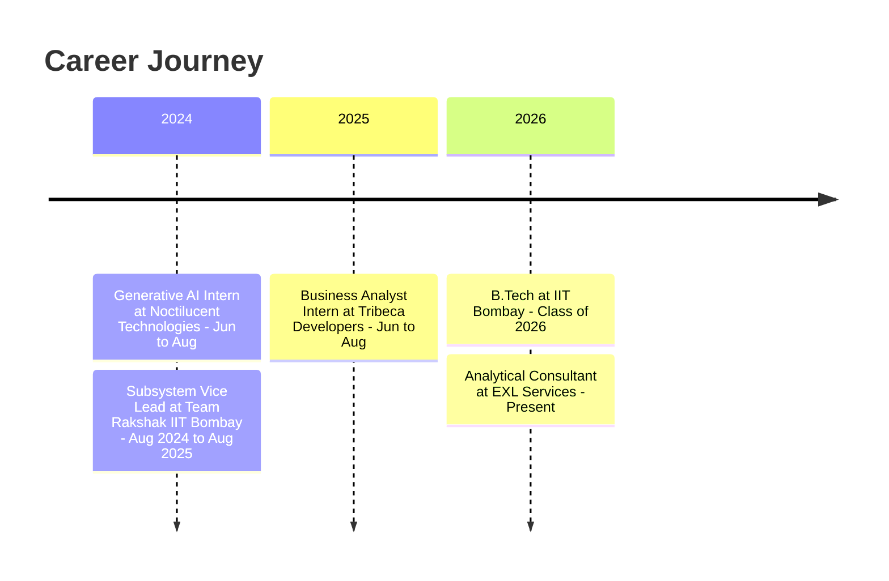

<div align="center">


<a href="https://www.linkedin.com/in/abhishek-kumar-22102612200420042210/"></a>
<a href="mailto:kumarabhishek.in01@gmail.com"></a>
<a href="https://github.com/NEC0S"></a>
<a href="https://leetcode.com/yourusername"></a>

<br/>


<br/>

<a href="#about">About</a> &nbsp;•&nbsp;
<a href="#stack">Tech Stack</a> &nbsp;•&nbsp;
<a href="#projects">Projects</a> &nbsp;•&nbsp;
<a href="#experience">Experience</a> &nbsp;•&nbsp;
<a href="#connect">Connect</a>

</div>

<br/>

<a id="about"></a>

## 👋 About Me

> I build data-driven and AI solutions that turn raw data into decisions.

```python
abhishek = {
    "role":         "Analytical Consultant @ EXL Services",
    "education":    "B.Tech, Mechanical Engineering @ IIT Bombay '26",
    "minor":        "Artificial Intelligence & Data Science (CPI 8.13)",
    "leadership":   "Subsystem Vice Lead @ Team Rakshak, IIT Bombay",
    "previously": [
        "Business Analyst Intern @ Tribeca Developers",
        "Generative AI Intern @ Noctilucent Technologies",
    ],
    "built_with": [
        "Generative AI", "Machine Learning", "Computer Vision", "Intelligent Systems",
    ],
    "learning": [
        "LangChain / LangGraph", "Agentic Workflows", "MLOps",
    ],
    "exploring":    "Entrepreneurship",
    "ask_me_about": ["AI", "Machine Learning", "Data Science", "Generative AI"],
}
```

<br/>

<a id="stack"></a>

## 🛠️ Tech Stack

<table>
<tr>
<td valign="top" width="25%">
<b>Programming &amp; Scripting</b><br/><br/>


</td>
<td valign="top" width="25%">
<b>Agentic AI</b><br/><br/>


</td>
<td valign="top" width="25%">
<b>ML / DL</b><br/><br/>


</td>
<td valign="top" width="25%">
<b>Data Analysis</b><br/><br/>


</td>
</tr>
<tr>
<td valign="top" width="25%">
<b>Databases</b><br/><br/>


</td>
<td valign="top" width="25%">
<b>Cloud &amp; DevOps</b><br/><br/>


</td>
<td valign="top" width="25%">
<b>Web &amp; APIs</b><br/><br/>


</td>
<td valign="top" width="25%">
<b>Tools</b><br/><br/>


</td>
</tr>
</table>

<br/>

<a id="projects"></a>

## 🚀 Projects

### 🤖 Generative AI & Agentic AI

<table>
<tr>
<th align="left" width="22%">Project</th>
<th align="left" width="58%">Overview</th>
<th align="left" width="20%">Links</th>
</tr>
<tr>
<td valign="top"><b>Prashna.ai</b></td>
<td valign="top">AI question paper generator that produces print-ready CBSE exam papers, with self-healing LaTeX compilation and per-question refinement.<br/><sub><i>LangGraph · Gemini · FastAPI · LaTeX</i></sub></td>
<td valign="top"><a href="https://github.com/NEC0S"></a><br/><a href="https://prashna-ai-043g.onrender.com/"></a></td>
</tr>
<tr>
<td valign="top"><b>Career Twin</b></td>
<td valign="top">Autonomous email agent that replies using only my resume and profile data, and escalates to me when unsure.<br/><sub><i>Gemini · OpenAI-Compatible API · IMAP/SMTP</i></sub></td>
<td valign="top"><a href="https://github.com/NEC0S"></a><br/><a href="ADD_LINK_HERE"></a></td>
</tr>
<tr>
<td valign="top"><b>Agentic AI Trading Floor</b></td>
<td valign="top">Multi-agent trading system where four autonomous traders use six MCP servers for market data, research, and memory.<br/><sub><i>OpenAI Agents SDK · MCP · Tavily</i></sub></td>
<td valign="top"><a href="https://github.com/NEC0S"></a><br/><a href="ADD_LINK_HERE"></a></td>
</tr>
</table>

### 📊 Data Science & Machine Learning

<table>
<tr>
<th align="left" width="22%">Project</th>
<th align="left" width="58%">Overview</th>
<th align="left" width="20%">Links</th>
</tr>
<tr>
<td valign="top"><b>FamApp Churn &amp; Retention</b></td>
<td valign="top">End-to-end churn prediction on 50K+ users and 500K+ transactions, with SHAP explainability (98% accuracy, 0.99 ROC-AUC).<br/><sub><i>XGBoost · SHAP · EDA</i></sub></td>
<td valign="top"><a href="https://github.com/NEC0S"></a><br/><a href="ADD_LINK_HERE"></a></td>
</tr>
<tr>
<td valign="top"><b>Architectural Design Optimization</b></td>
<td valign="top">Computer vision and clustering pipeline that extracts metrics from ~1K architectural layouts, served as a Flask web app.<br/><sub><i>OpenCV · K-Means · DBSCAN · Flask</i></sub></td>
<td valign="top"><a href="https://github.com/NEC0S"></a><br/><a href="ADD_LINK_HERE"></a></td>
</tr>
<tr>
<td valign="top"><b>Battery Discharge Modeling</b></td>
<td valign="top">Factorial experiment on how screen brightness and app type affect battery discharge, analyzed with ANOVA and Bayesian inference.<br/><sub><i>ANOVA · Bayesian Inference · Experimental Design</i></sub></td>
<td valign="top">—</td>
</tr>
</table>

### ⚙️ DevOps & Cloud

<table>
<tr>
<th align="left" width="22%">Project</th>
<th align="left" width="58%">Overview</th>
<th align="left" width="20%">Links</th>
</tr>
<tr>
<td valign="top"><b>CloudCart Agent</b></td>
<td valign="top">Tool-using AI support agent with RAG and order lookup, provisioned with Terraform, deployed via GitHub Actions, and monitored in CloudWatch.<br/><sub><i>Terraform · GitHub Actions · AWS Bedrock · Lambda</i></sub></td>
<td valign="top"><a href="https://github.com/NEC0S"></a><br/><a href="http://abhishek-chatbot-frontend-2026.s3-website.eu-north-1.amazonaws.com/"></a></td>
</tr>
<tr>
<td valign="top"><b>Terraform Static Site</b></td>
<td valign="top">S3 static website managed as code. Pull requests run a Terraform plan, and merges to main apply automatically.<br/><sub><i>Terraform · GitHub Actions · S3</i></sub></td>
<td valign="top"><a href="https://github.com/NEC0S"></a><br/><a href="http://abhishek-kumar-tf-demo-2026.s3-website.eu-north-1.amazonaws.com/"></a></td>
</tr>
</table>

<br/>

<a id="experience"></a>

## 💼 Experience



<br/>

## 📊 GitHub Stats

<div align="center">


</div>

<br/>

<a id="connect"></a>

## 📫 Let's Connect

<div align="center">

<a href="https://www.linkedin.com/in/abhishek-kumar-22102612200420042210/"></a>
<a href="mailto:kumarabhishek.in01@gmail.com"></a>

<br/><br/>


</div>
